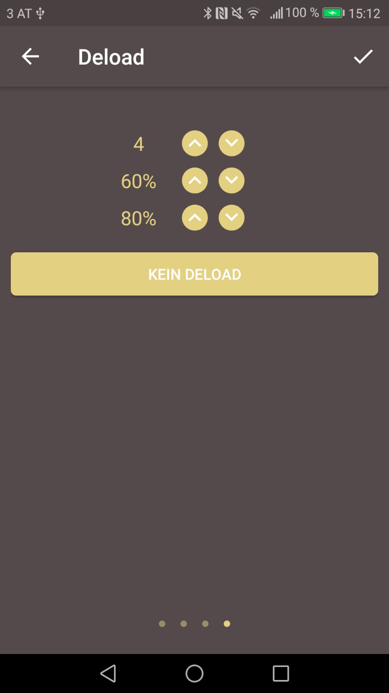
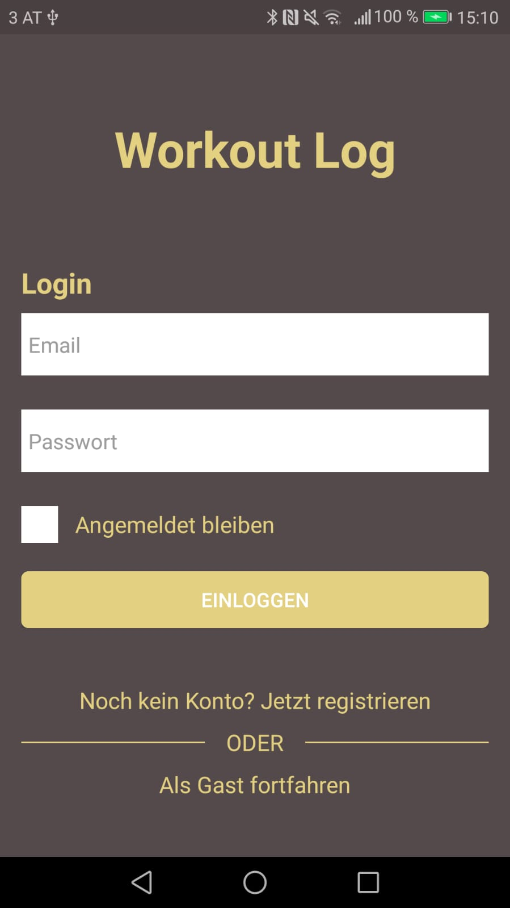
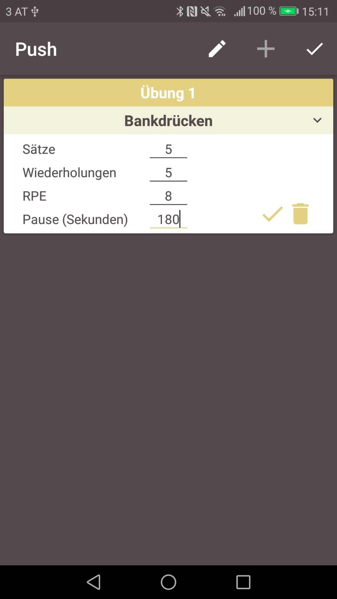
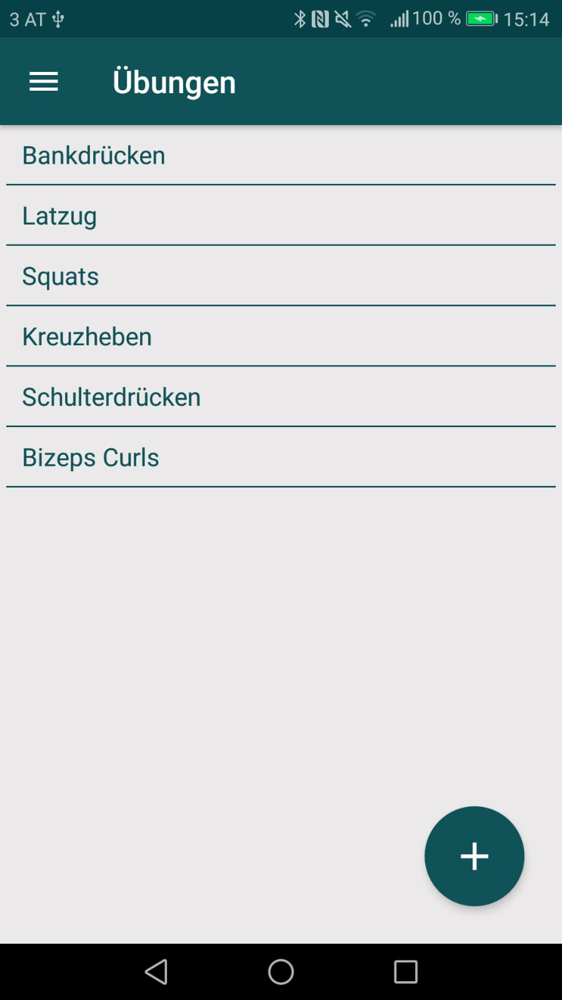
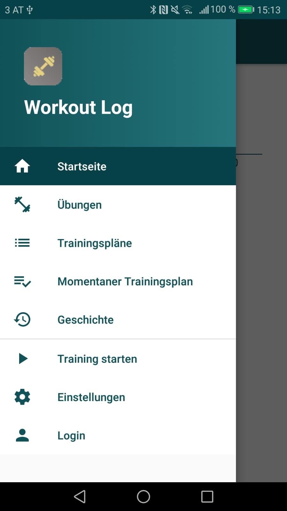
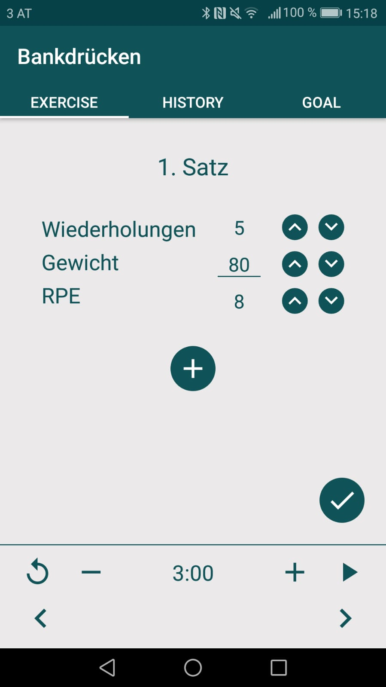

# WorkoutLog
This is an Android App that helps people who go to the gym track, organize and simplify their workouts.

## Motivation
This app was developed in order to strengthen my skills in Android development. Now it is meant to show off my skills in this area.

## Getting Started
This project uses the Gradle build system. To build this project, use the gradlew build command or use "Import Project" in Android Studio.

## Screenshots

## Libraries used
* Foundation
  * [AppCompat](https://developer.android.com/topic/libraries/support-library/packages)
  * [Android KTX](https://developer.android.com/kotlin)
* Architecture
  * [Room](https://developer.android.com/topic/libraries/architecture/room?hl=en-419)
  * [Multidex](https://developer.android.com/studio/build/multidex)
  * [Firebase Auth](https://firebase.google.com/docs/auth/)
  * [Firebase Firestore](https://firebase.google.com/docs/firestore)
  * [RecyclerView Selection](https://developer.android.com/reference/androidx/recyclerview/selection/package-summary)
  * [Preference](https://developer.android.com/reference/android/preference/package-summary)
* UI
  * [ConstraintLayout](https://developer.android.com/reference/android/support/constraint/ConstraintLayout)
  * [Material](https://material.io/develop/android/docs/getting-started/)
* Third Party
  * [MaterialDateTimePicker](https://github.com/wdullaer/MaterialDateTimePicker)

## Additional Resources
[Link](https://play.google.com/store/apps/details?id=com.workoutlog.workoutlog) to the App in the Google Play Store

## Author
Andreas Pribitzer
